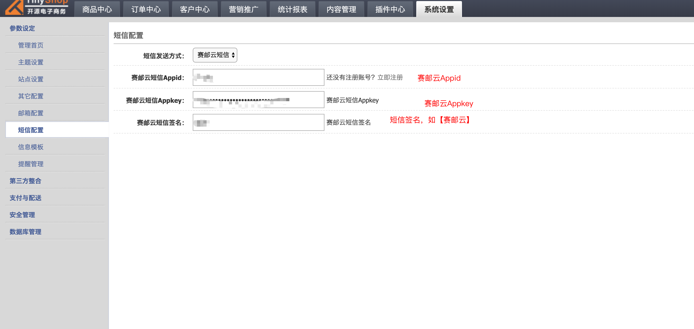

## OVERVIEW

### Tinyshop Plug-Ins Overview

------

How to use

使用方法
        1：本插件针对TinyShop系统3.1开发，安装前请仔细核对你的系统软件版本；
        2：如果你的软件经过二次开发，请核对修改，谨慎覆盖；。
        3：进入系统后台->参数设定->短信配置，填写赛邮云短信配置，为保证短信发送正常。

[点击下载](https://github.com/submail-developers/tinyshop_sms/archive/master.zip)
